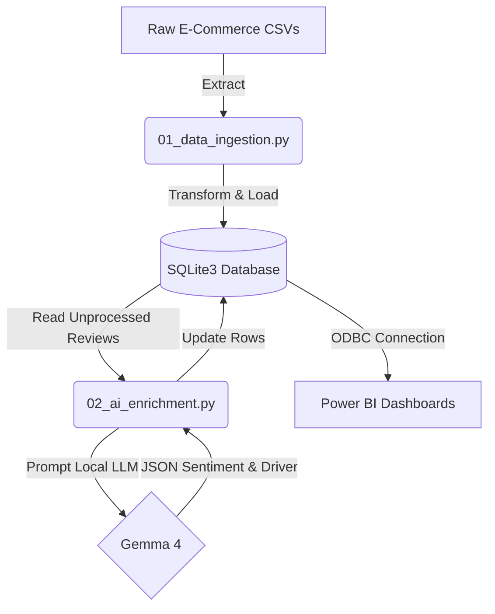

# Customer Product Insights Pipeline

## Summary
This repository contains an end-to-end data pipeline designed to extract, transform, and load regional e-commerce operations data into a dimensional Star Schema, enriched with AI-generated customer insights. By using a local Large Language Model (Gemma 4) to analyze 5,000 unstructured customer reviews, the pipeline automates the extraction of qualitative primary business drivers (e.g., Shipping, Quality, Customer Service) and quantitative sentiment scores. This architecture provides scalable, actionable intelligence to rapidly identify high-performing product segments and optimize the customer experience, all while maintaining strict data privacy through local AI inference.

---

## Architecture Diagram



---

## Data Dictionary
The underlying SQLite database is modeled using a standard Star Schema optimized for Business Intelligence reporting.

| Table Name | Type | Key Columns / Description |
| :--- | :--- | :--- |
| **Dim_Customer** | Dimension | `customer_id`, `customer_city`, `customer_state`, `Map_Location` |
| **Dim_Product** | Dimension | `product_id`, `product_category_name` |
| **Dim_Order** | Dimension | `order_id`, `order_status`, `purchase_timestamp` |
| **Fact_OrderItem** | Fact | `order_item_id`, `order_id`, `product_id`, `customer_id`, `price`, `freight_value` |
| **Fact_Review** | Fact | `review_id`, `order_id`, `review_score`, `ai_sentiment`, `ai_driver`, `processing_status` |

---

## Local Replication Instructions
Follow these steps to initialize the database and run the AI inference pipeline on your local machine.

**1. Prerequisites**
Ensure you have Python 3.9+ and [Ollama](https://ollama.com/) installed on your machine. You will also need the SQLite ODBC Driver installed if you intend to connect the final database to Power BI.

**2. Clone the Repository & Install Dependencies**
```bash
git clone [https://github.com/Kasper-Bankler/customer-product-insights-pipeline.git](https://github.com/Kasper-Bankler/customer-product-insights-pipeline.git)
cd ecommerce-ai-pipeline
pip install pandas requests
```

**3. Initialize the Local LLM**
Before running the enrichment script, ensure the Ollama service is running in the background and pull the Gemma 4 model.
```bash
ollama run gemma
```

**4. Run the Data Ingestion Pipeline**
This script parses the raw CSV files, handles data type casting, structures the Star Schema, and deterministically samples exactly 5,000 review rows for AI processing.
```bash
python 01_data_ingestion.py
```

**5. Run the AI Enrichment Pipeline**
This script establishes a connection to the local SQLite database, retrieves the queued customer reviews, and sends them to the local Ollama API. It parses the JSON output and safely updates the database with the AI-assigned sentiment and business drivers.
```bash
python 02_ai_enrichment.py
```

## Dashboard Showcase

<p align="center">
    
    
</p>
